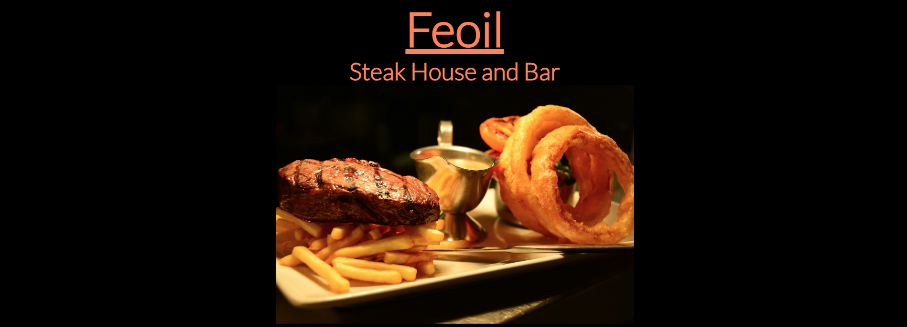
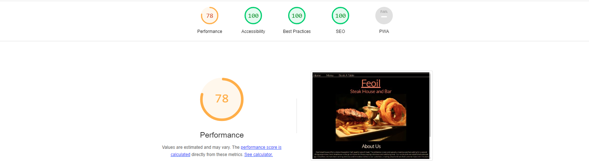

<h1>Feoil Steakhouse and Bar</h1>

<h2>Introduction</h2>

Feoil Steakhouse and Bar website is a landing page for a fine dining, steakhouse restaurant. 
Feoil is the Irish word for meat. 
Users of this website will find all the information they need about the restaurant. 
Feoil Steakhouse and Bar includes an about us, contact us, menu and a booking form sections, 
this website targeted for people of all ages who want a fine dining steakhouse experience.

<h2>Features</h2>
<h3>Navigation</h3>
<ul>
<li>At the top of the page is the navigation bar, on the left of the navigation bar are three different links.</li>
<li>The three links are Home, Menu and Book a Table which directs the user to different pages.</li>
<li>The color used is Bisque and the font-family is Lato.</li>
</ul>

<h3>The Header</h3>
<ul>
<li>The Header clearly shows the name of the restaurant and also contains an image of a steak dish. </li>
<li>The color used for the header is coral and the font-family is Lato.</li>
</ul>

<h3>About Us</h3>
<ul>
<li>The about us section gives a brief description about the restaurant and when it was established.</li>
<li>The about us section uses a color of Bisque and a font-family of Lato. </li>
</ul>

<h3>Contact Us</h3>
<ul>
<li>The contact us section contains information on the address, phone number and email address.</li>
<li>The contact us section uses a color of Bisque and a font-family of Lato. </li>
</ul>

<h3>The Footer</h3>
<ul>
<li>The footer contains links to social media websites</li>
<li>The background-color used is Bisque and the color used is black</li>
<li>The social media links are displayed as icons </li>
</ul>

<h3>The Menu</h3>
<ul>
<li>The menu page has the same navigation bar, header and footer as the home page. </li>
<li>The menu contains three different sections, starters, main course and dessert.</li>
<li>The menu section has a different header image to show that the user is on a separate page.</li>
<li>The background-color is black and color used is coral, the font-family is lato.</li>
</ul>

<h3>Book a Table</h3>
<ul>
<li>The bookings page has the same navigation bar, header and footer as the home page and menu page.</li>
<li>The booking page also has a different image to the home page and menu page to show the user they are on a different page.</li>
<li>The booking page has a form section to collect details from the user such as first name, last name, email address, the time  and the month and date they would like to book a table.</li>
<li>The background-color is black and the color used is coral, the font-family is lato.</li>
</ul>

<h2>Testing</h2>
<h3>Validator Testing</h3>
<ul>
<li>HTML</li>
No errors were returned when passing through the official W3c Validator.

<li>CSS</li>
No errors were returned when passing through the official Jigsaw Validator.

<li>Accessibility</li>
This website is responsive and the color and fonts are easy to read, this was tested by using dev tools and lighthouse.

</ul>

<h2>Deployment</h2>
This website was deployed to GitHub. The steps to deploy are as follows:
<ul>
<li>In the GitHub repository go to the settings tab.</li>
<li>From the source section drop-down menu, select the master branch.</li>
<li>Once the master branch has been selected, the page provides the link to complete the website.</li>
</ul>

<h2>Credits</h2>
<h3>Content</h3>
<ul>
<li>Some of the could for the CSS responsive layout was taken from Youtube tutorials such as:[Kevin Powell responsive web design](https://www.youtube.com/watch?v=x4u1yp3Msao&t=730s&pp=ygUfa2V2aW4gcG93ZWxsIHJlc3BvbnNpdmUgd2Vic2l0ZQ%3D%3D)</li>
</ul>